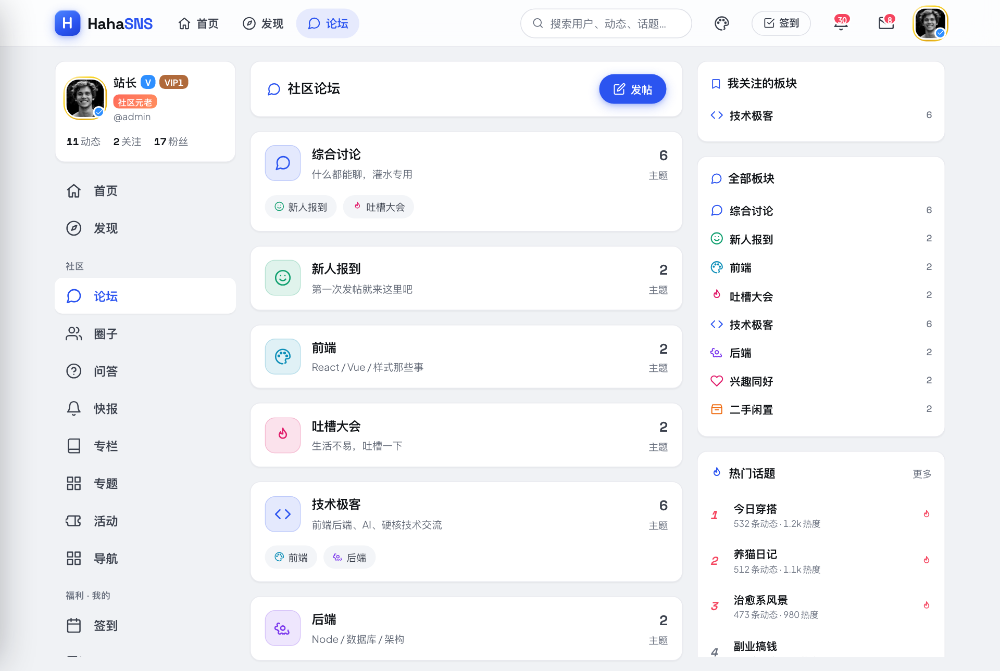
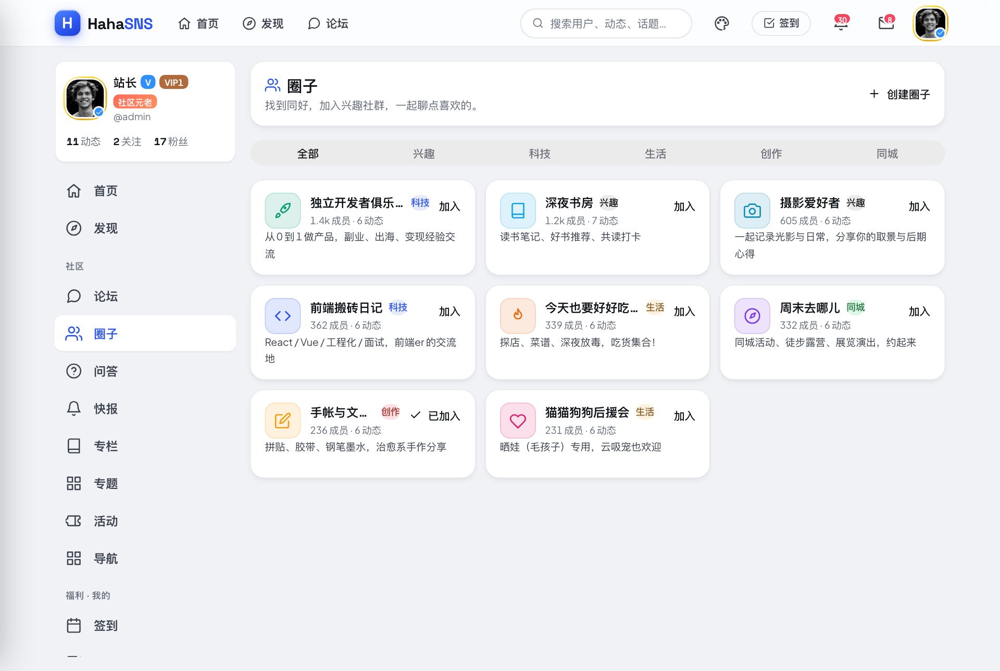

# HahaSNS · 轻社交 · 轻论坛 · 轻社区

> **HahaSNS**（中文主题名「哈哈」）是一款轻量级、一站式的开源社区系统 —— 把**信息流式 SNS**、**BBS 论坛**与**积分驱动的社区中心**融合在同一个精致的 Web 应用里。界面以真实产品的标准打磨：桌面端三栏布局、移动端底部标签栏布局，原生支持浅色 / 深色与 6 套配色皮肤。

**HahaSNS = 轻社交 · 轻论坛 · 轻社区** —— 从零原创、可自托管、可商用二次开发的现代社区平台。

🔗 **在线演示：** http://43.226.60.75:5388

---

## 📚 目录

- [项目简介](#-项目简介)
- [功能清单](#-功能清单)
- [截图预览](#-截图预览)
- [技术栈](#-技术栈)
- [快速开始](#-快速开始)
- [目录结构](#-目录结构)
- [文档导航](#-文档导航)
- [加入社区](#-加入社区)
- [开源协议](#-开源协议)
- [贡献指南](#-贡献指南)

---

## 🌟 项目简介

HahaSNS 想解决的问题很简单：很多团队既想要「朋友圈式」的动态社交，又想要「贴吧式」的论坛沉淀，还想要积分、签到、商城、勋章这些让社区活跃起来的运营工具 —— 通常这意味着要拼三四套系统。HahaSNS 把这些能力做进**一个**代码库、**一套**账号体系、**一致**的设计语言里，开箱即用。

- **一站式**：SNS 动态、BBS 论坛、兴趣圈子、问答悬赏、资讯快报、专栏文章、活动报名、网址导航、排行榜、任务勋章、签到、抽奖、积分商城、会员体系、私信、独立后台，全部内置。
- **好部署**：生产后端是 NestJS + MariaDB + Redis，一份 `docker-compose.yml` 即可起全栈（线上 Demo 即此架构，见 [1Panel](docs/INSTALL-1panel.md) / [宝塔](docs/INSTALL-bt.md) 教程）；另保留一个零外部依赖的 Express + SQLite 简版后端，适合本地开发与快速试用。
- **现代前端**：React 19 + HeroUI v3 + TypeScript + Tailwind 4 + Vite，6 套配色皮肤 × 浅 / 深色，配合 framer-motion 页面转场，桌面与移动端均为原生体验。
- **可运营**：积分、经验、等级、签到、任务、勋章、抽奖、商城、会员（VIP / V 认证）等成长与激励体系一应俱全，并配有功能完整的独立后台。
- **开源**：MIT 协议，欢迎自托管、二次开发与贡献。

---

## ✨ 功能清单

### 动态（SNS Feed）
发布文字 / 图片 / 视频 / 音乐动态，支持 **5 种可见范围**（公开 · 私密 · 密码 · 付费 · 匿名）；点赞、嵌套评论、转发、@提及、`#话题#`、打赏；带定位、设备标识（手机端 / 电脑端）与浏览量；信息流可按推荐 / 最新 / 关注 / 视频 / 同城筛选；支持收藏、置顶、全站置顶与付费内容解锁。

### 投票（Polls）
可为任意动态附加**单选或多选投票**（2–6 个选项），支持设置截止时间与实时倒计时；每人一票，投票后或截止后揭晓各选项百分比与总参与人数。

### 论坛（BBS Forum）
板块 + 子板块、版主（版主）体系；发帖、嵌套回复、点赞；帖子管理（置顶 / 精华 / 锁定 / 删除）；板块封面、图标、公告、排序；帖子可按最新回复 / 热门 / 精华排序；支持关注板块。

### 圈子（Circles）
创建并加入兴趣**圈子**，可设名称、描述、图标与颜色；分类涵盖兴趣 / 科技 / 生活 / 创作 / 同城，可按热门 / 最新浏览或查看「我加入的」；每个圈子有独立的成员动态流、成员列表与实时统计；圈主自动加入且不可退出自己的圈子。

### 问答 · 悬赏（Q&A with Bounties）
提问可附带**积分悬赏**，提交时从提问者处托管相应积分；支持分类（综合 / 技术 / 生活 / 情感 / 职场 / 校园 / 数码）与排序（最新 / 热门 / 悬赏）；可发布回答、为最佳回答点赞，提问者**采纳**后问题标记为已解决并把悬赏积分转给回答者；高悬赏未解决问题会在侧边栏重点推荐。

### 资讯快报（Flash News）
分类的资讯与公告门户（公告 / 功能 / 活动 / 精选 / 教程），置顶优先、最新优先；条目可外链到完整 URL；由管理员发布。

### 专栏文章（Articles）
支持撰写与发布长文专栏，独立的文章列表与详情页，适合教程、公告、深度内容沉淀。

### 活动（Events）
活动发布与报名，独立的活动列表与详情页，便于组织线上线下社区活动。

### 网址导航（Link Directory）
精选网址导航，按有序分类组织、每个分类下有序排列链接；内置**点击排行**，每次访问都会被记录并驱动「热门导航」侧边栏组件；分类与链接由管理员管理。

### 排行榜（Leaderboards）
多维度榜单：财富榜、等级榜、人气榜、签到榜，激励用户活跃与成长。

### 任务 · 勋章（Tasks & Achievements）
**任务中心**提供每日任务（签到 / 发布动态 / 评论 / 点赞 / 参与投票）与成长任务（完善资料），完成后可领取积分奖励，进度依据真实活动实时计算；**成就勋章**按青铜 / 白银 / 黄金分级，依据累计数据解锁（首次发帖、发帖 20 篇、投票 10 次、连续签到 7 天、50 名粉丝、200 个赞、被采纳回答、圈子创始人、VIP 等），展示于个人勋章墙与公开主页。

### 签到（Daily Check-in）
每日签到，连续签到天数累计，发放积分 / 经验奖励，配合签到榜形成留存激励。

### 抽奖（Lottery）
消耗积分参与抽奖，丰富社区互动玩法与积分消耗场景。

### 积分商城（Points Mall）
用积分兑换头衔、头像框、消耗类道具与实物商品，含库存 / 售罄 / 已拥有状态；与积分、余额体系打通，是积分消耗与运营活动的核心场景。

### 会员中心（Member Center）
基于 JWT 的注册 / 登录（密码 `bcryptjs` 哈希）；头像 + 封面图、个性签名、性别、所在地；支持 **V 认证**徽章、**VIP** 会员、经验值驱动的**等级系统**、**积分**与**余额**钱包；关注 / 粉丝、消息通知（关注 / 点赞 / 评论 / 回复 / @提及 / 打赏 / 系统）；充值中心（模拟）、VIP 开通、改名（消耗商城「改名卡」）、修改密码。

### 私信（Direct Messages）
用户间一对一私信会话，与通知体系联动。

### 安全防护（Safety & Moderation）
内置敏感词过滤，覆盖用户生成内容；支持举报内容、拉黑名单、问题反馈；JWT 鉴权与密码哈希保护账号安全。

### 独立后台（Admin Console）
仅管理员可见的功能完整后台：站点统计与 7 天活跃度、用户管理（设置 V / VIP / 管理员 / 封禁 / 积分）、板块增删改查与分配版主、话题管理、举报处理、商品管理、内容下架，以及资讯快报与网址导航的内容维护；站点设置（模块开关、外观、安全）与「布局」配置——各页面三栏 / 宽屏 / 居中布局可在后台直接切换，无需改代码。

### 其它（Extras）
全局搜索（用户 / 动态 / 帖子 / 话题）、热搜关键词、浏览历史、推荐关注；内置 AI 助手聊天页（两栏布局、流式输出）；🎨 **6 套配色皮肤**（经典蓝 / 锐紫 / 翡翠 / 落日橙 / 玫瑰 / 青碧）× 🌗 浅色 / 深色，配合 framer-motion 页面转场；响应式（桌面三栏 + 移动底部标签栏）。

---

## 🖼️ 截图预览

| 动态 / Feed | 论坛 / Forum |
| --- | --- |
|  |  |

| 个人主页 / Profile | 圈子 / Circles |
| --- | --- |
|  |  |

> 欢迎补充更多截图 —— 放入 `client/public/showcase/` 目录并在此处引用即可。

---

## 🧱 技术栈

### 前端（client/）

| 层级 | 选型 |
| --- | --- |
| 框架 | **React 19** |
| UI 组件库 | **HeroUI v3**（`@heroui/react` + `@heroui/styles`） |
| 语言 | **TypeScript** |
| 样式 | **Tailwind CSS 4**（CSS-first，经 `@tailwindcss/vite` 接入） |
| 构建 | **Vite 5** |
| 路由 / 请求 | React Router 6、Axios |
| 动效 | framer-motion 页面转场 |
| 主题 | 6 套配色皮肤 × 浅 / 深色，运行时切换 |

### 后端（server-nest/）

| 层级 | 选型 |
| --- | --- |
| 框架 | **NestJS 10** + TypeScript |
| ORM | **TypeORM 0.3** |
| 数据库 | **MySQL / MariaDB**（也支持 PostgreSQL） |
| 缓存 | **Redis**（`ioredis` + `cache-manager`） |
| 对象存储 | **S3 兼容对象存储**（`@aws-sdk/client-s3`，可签发预签名 URL）；未配置时回退本地磁盘 |
| 鉴权 | `@nestjs/jwt` + `bcryptjs` |
| 校验 | `class-validator` / `class-transformer` |

后端是单进程 NestJS 应用，同时伺服 `/api`、构建后的 SPA 与 `/uploads`，覆盖全部功能模块；数据落 MySQL/MariaDB、Redis 做缓存、媒体可交给 S3。配套 `docker-compose.yml` 一键起 `app + mariadb + redis`（线上 Demo 即此架构）。

---

## 🚀 快速开始

> 需要 **Node.js 18+**（推荐 20 LTS）。后端需要 **MySQL/MariaDB** 与 **Redis**——最省事是用 Docker（见下）。

### 方式 A：Docker 一键起全栈（推荐）

```bash
cp .env.example .env      # 填 JWT_SECRET、DB_PASSWORD
docker compose up -d --build
# → http://localhost:4000  （app + mariadb + redis 一并起好，app 首启自动建表）
```

详见 [1Panel](docs/INSTALL-1panel.md) / [宝塔](docs/INSTALL-bt.md) 部署教程。

### 方式 B：本地开发

先准备好 MySQL/MariaDB 与 Redis（或 `docker compose up -d mariadb redis`），然后：

```bash
cp server-nest/.env.example server-nest/.env   # 配 DB_*/REDIS_URL/JWT_SECRET
npm run install:all                            # 装 server-nest + client 依赖
npm run dev                                     # 同时起 NestJS(:4000, 监听重载) + 前端(:5173)
# → 前端 http://localhost:5173（已代理 /api、/uploads 到 4000）
```

> 生产构建：`npm run build`（构建前端 + 编译 server-nest），再 `npm start` 跑 `server-nest`（单进程伺服 SPA + /api + /uploads）。详见下方文档导航。

---

## 📁 目录结构

```
hahasns/
├── client/          # 前端 SPA：React 19 + HeroUI v3 + TypeScript + Tailwind 4 + Vite
│   ├── public/showcase/   # 截图素材
│   └── src/               # pages / components / context / styles
├── server-nest/     # 后端：NestJS + TypeORM + MySQL/MariaDB + Redis + S3（单进程伺服 SPA+/api+/uploads）
│   ├── src/               # 各功能模块（auth/users/posts/forum/…）
│   └── scripts/           # 部署/迁移脚本（redeploy.sh、migrate-sqlite-to-mysql.js）
└── docs/            # 文档：安装、开发、部署、宝塔教程、架构、API、配置
```

---

## 📖 文档导航

| 文档 | 内容 |
| --- | --- |
| [docs/INSTALL.md](docs/INSTALL.md) | 安装手册：主机规格、依赖、构建与部署步骤 |
| [docs/DEVELOPMENT.md](docs/DEVELOPMENT.md) | 开发手册：本地开发流程、项目结构、构建打包、常用脚本 |
| [docs/INSTALL-bt.md](docs/INSTALL-bt.md) | 宝塔面板（BT Panel / aaPanel）图文部署教程 |
| [docs/DEPLOY.md](docs/DEPLOY.md) | 通用生产部署（systemd / pm2 + Nginx + HTTPS） |
| [docs/ARCHITECTURE.md](docs/ARCHITECTURE.md) | 系统架构说明 |
| [docs/API.md](docs/API.md) | REST 接口参考 |
| [docs/CONFIGURATION.md](docs/CONFIGURATION.md) | 配置与环境变量 |

---

## 💬 加入社区

种子用户们，欢迎加入 **HahaSNS 微信群**，一起反馈体验、抢先尝鲜、共建路线图：


用微信扫码加群；或添加微信号 **`xiaolizi1579687`**（凤梨酥）为好友，邀你进群。
（群二维码会定期更新，若已失效，直接加上面的微信号即可。）

---

## 📄 开源协议

本项目以 **MIT License** 发布，详见仓库根目录的 [LICENSE](LICENSE)。可自由用于学习、自托管与商业二次开发，请保留版权与协议声明。

> 随附的演示媒体（头像、封面图、示例视频 / 音频）取自第三方服务（pravatar.cc、picsum.photos 等），仅用于演示。生产环境请替换为你自己的素材。

---

## 🤝 贡献指南

欢迎任何规模的贡献，从错别字修正到新功能。请先阅读 [CONTRIBUTING.md](CONTRIBUTING.md)，简要流程：

1. Fork 仓库并克隆到本地。
2. 基于 `main` 创建特性分支：`git checkout -b feature/简短描述`。
3. 按现有代码风格提交聚焦、清晰的改动。
4. 向上游仓库发起 Pull Request，说明**改了什么**与**为什么改**。

报告 Bug 或安全问题时，请勿在内容中包含任何真实密钥、密码、令牌或服务器地址。
