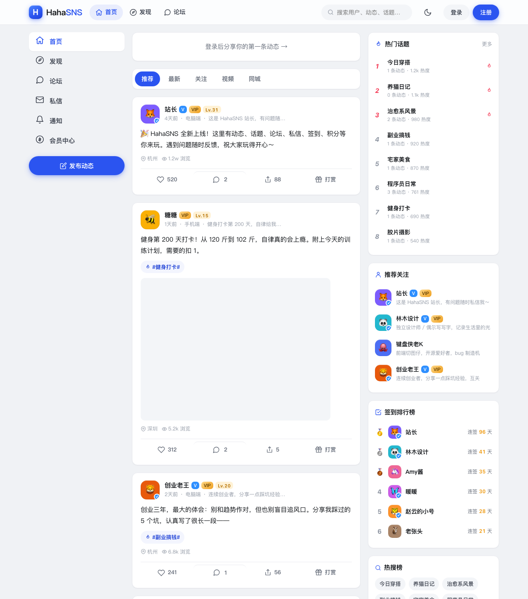
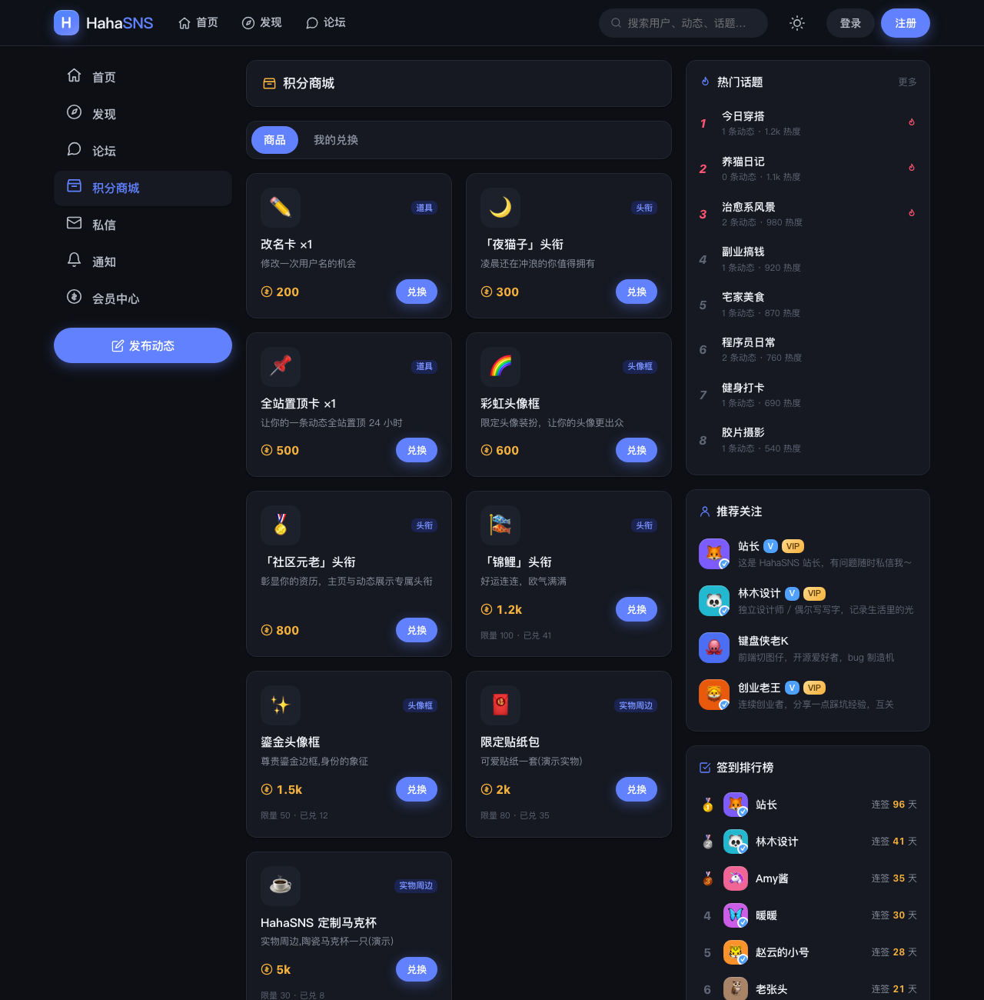
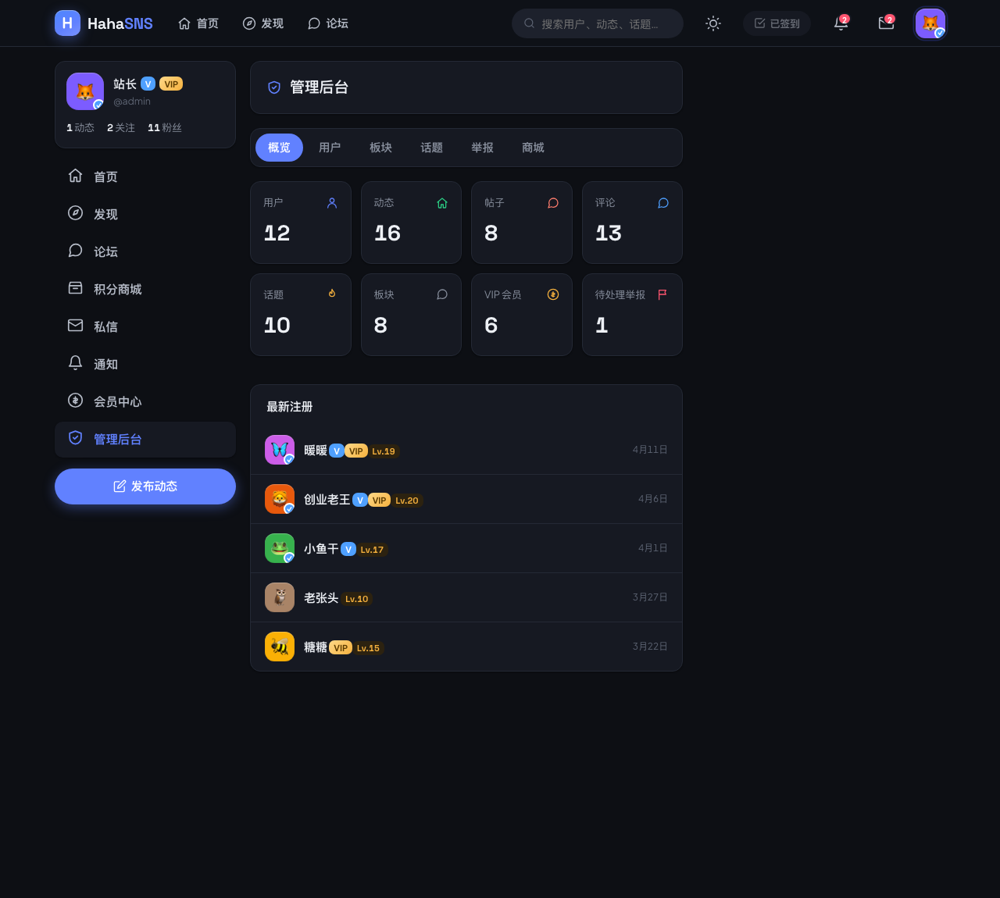

# HahaSNS · 轻社交 · 轻论坛 · 轻社区

> **HahaSNS**（中文主题名「哈哈」）is a lightweight, all-in-one social community platform — a feed-based SNS, a BBS-style forum, and a points-driven community center, all in one polished web app. The Chinese-language UI is built to feel like a real product, with a three-column desktop layout and a mobile bottom-tab layout.

**HahaSNS = 轻社交 · 轻论坛 · 轻社区** — an original, from-scratch lightweight social-community platform built on a modern React + Express + SQLite stack.

🔗 **Live demo:** http://43.226.60.75:5388



---

## ✨ Features

### 会员中心 / Member Center
- Register / login with JWT (`bcryptjs`-hashed passwords)
- Avatar + cover image, signature (bio), gender, city/location
- **V 认证** (verified badge), **VIP** membership, **等级系统** (experience-driven `Lv.X`), **积分** (points) & **余额** (wallet balance)
- **每日签到** (daily sign-in with consecutive-day streak + points/exp rewards)
- Follow / followers, private messages, notifications (follow / like / comment / reply / @mention / reward / system)
- Recharge center (simulated) + VIP activation
- Change username (consumes a 改名卡 mall item), change password

### SNS 动态 / Feed
- Post text / image / video / music (audio) updates
- **5 visibility modes**: 公开 public · 私密 private · 密码 password · 付费 paid · 匿名 anonymous
- Like · nested comments · repost (转发) · @mention · `#话题#` topics · reward (打赏)
- Location · device tag (手机端 / 电脑端) · view counts
- Feed filters: 推荐 recommend · 最新 latest · 关注 following · 视频 video · 同城 same-city
- Bookmarks (收藏), pin own post (置顶), global pin (全站置顶卡), paid-post unlock

### BBS 论坛 / Forum
- Boards + sub-boards, moderators (版主)
- Create threads, nested replies, likes
- Thread moderation: 置顶 pin · 精华 elite · 锁定 lock · delete
- Board cover / icon / announcement / sort; thread sort by 最新回复 / 热门 / 精华
- Follow boards (关注板块)

### 话题 · 商城 · 后台 / Topics, Mall & Admin
- Topic square (话题广场), hot topics, follow topics
- **积分商城 / Points mall**: redeem titles (头衔), avatar frames (头像框), consumable items (道具), and physical goods — with stock / sold-out / owned states
- **后台管理 / Admin** (admin-only): site stats + 7-day activity, user management (set V / VIP / admin / ban / points), board CRUD + assign moderators, topic management, report handling, product management, content removal

### 圈子 / Circles — 兴趣社区
- Create & join interest **circles** (圈子) with name, description, icon and color
- Categories: 兴趣 · 科技 · 生活 · 创作 · 同城; browse by 热门 hot / 最新 new, or "我加入的" (joined)
- Per-circle **feed** of member posts, member list, live member / post counts; sidebar suggestions for circles you haven't joined yet
- Circle owner (圈主) is auto-joined and cannot leave their own circle

### 投票 / Polls
- Attach a **single- or multi-choice poll** to any post (2–6 options)
- Optional **deadline** (up to 30 days) with a live countdown; long-running polls supported
- One vote per user; **live results** (per-option percentages + total participants) revealed after you vote or once the poll closes

### 问答 · 悬赏 / Q&A with Bounties
- Ask questions with an optional **积分 bounty** — points are **escrowed** from the asker on submit
- Categories (综合 · 技术 · 生活 · 情感 · 职场 · 校园 · 数码) and sorts: 最新 / 热门 / 悬赏
- Post **answers**, **upvote** the best ones (toggle); asker can **accept** a best answer (采纳) — which marks the question 已解决 and **transfers the bounty** to the answerer
- Notifications on new answer / acceptance; high-bounty open questions surfaced in a sidebar spotlight

### 资讯快报 / Flash News
- A categorized **news & announcement portal** (公告 · 功能 · 活动 · 精选 · 教程)
- Pinned-first, newest-first feed; entries can link out to a full URL
- Admin-published (admin-only posting)

### 网址导航 / Link Directory
- A curated **link directory** organized into ordered categories, each with ordered links
- **Click ranking** — every visit is tracked, powering a "热门导航" (most-clicked) sidebar widget
- Admin-managed categories & links

### 任务 · 勋章 / Tasks & Achievements
- **任务中心 / Task center**: daily tasks (签到 / 发布动态 / 评论 / 点赞 / 参与投票) + growth tasks (完善资料), each with point rewards you **claim** when complete; progress derived live from your real activity
- **成就勋章 / Achievement badges**: tiered (bronze / silver / gold) badges unlocked from cumulative stats — first post, 20 posts, 10 votes, 7-day streak, 50 fans, 200 likes, accepted answer, circle founder, VIP — shown on a personal **勋章墙** and on public profiles

### 其它 / Extras
- Global search (users · posts · threads · topics), trending keywords (热搜榜)
- **排行榜 / Leaderboards**: 财富榜 wealth · 等级榜 level · 人气榜 fans · 签到榜 check-in
- Suggested users to follow, block list (拉黑), report content (举报), user feedback (问题反馈)
- 🎨 **6 color skins** (经典蓝 / 锐紫 / 翡翠 / 落日橙 / 玫瑰 / 青碧) × 🌗 light / dark, with framer-motion page transitions; responsive (desktop three-column + mobile bottom-tab)
- Built-in sensitive-word filter on user-generated content

---

## 🖼️ Screenshots

| Home / 首页 | Mall / 积分商城 | Admin / 后台 |
| --- | --- | --- |
|  |  |  |

> _More screenshots welcome — drop them in `docs/` and reference them here._

---

## 🧱 Tech stack

| Layer | Choice |
| --- | --- |
| Frontend | **React 18** + **Vite 5**, React Router 6, Axios |
| UI | **HeroUI v2.8** (`@heroui/react`) on **Tailwind CSS**, with **framer-motion** page transitions, plus a hand-written **custom CSS design system** (tokens → base → layout → components → pages). **6 color skins** (经典蓝 / 锐紫 / 翡翠 / 落日橙 / 玫瑰 / 青碧) × light/dark, themed at runtime via `ThemeContext` |
| Backend | **Node.js** + **Express 4** |
| Database | **better-sqlite3** (embedded SQLite, WAL mode) |
| Auth | JWT (`jsonwebtoken`) + `bcryptjs` |
| Uploads | `multer` (local disk, images / video / audio) |

There is no external database or service to provision — SQLite lives in a single file under `server/data/` and is created automatically on first run.

---

## 🚀 Quick start

Requires **Node.js 18+**.

```bash
# 1. install deps for both server and client
npm run install:all          # or: npm --prefix server install && npm --prefix client install

# 2. seed demo data (12 showcase users, posts, topics, boards, threads, messages, mall)
npm run seed                 # runs server/src/seed.js + seed-extra.js

# 3a. dev mode — hot reload (server on :4000, client on :5173 with /api proxy)
npm install                  # installs `concurrently` at the repo root
npm run dev                  # → http://localhost:5173

# 3b. OR production mode — build the client, serve API + static SPA on one port
npm start                    # builds client/dist, then → http://localhost:4000
```

**Demo accounts (your own seeded instance only):** after `npm run seed`, an `admin` account and all demo users (`linmu`, `coder_k`, `amy`, …) are created with the password `hahasns123` — override it with the `SEED_PASSWORD` env var, and **change it before any public deployment**. These credentials are for local/self-hosted instances; on the hosted demo above, please just register your own account.

See **[docs/INSTALL.md](docs/INSTALL.md)** for the full setup guide (including bulk seeding to 1,000 users / 10,000 posts), **[docs/API.md](docs/API.md)** for the REST reference, **[docs/DEPLOY.md](docs/DEPLOY.md)** for deployment, and **[docs/ARCHITECTURE.md](docs/ARCHITECTURE.md)** for the system architecture.

---

## 📁 Project structure

```
hahasns/
├── server/                     # Express API + SQLite
│   ├── .env.example            # environment variable template
│   └── src/
│       ├── index.js            # app entry (registers routes, serves built client)
│       ├── db.js               # SQLite connection + schema load + migrations
│       ├── schema.sql          # full DB schema (users, posts, threads, mall, …)
│       ├── helpers.js          # levels/exp, publicUser serialization, notifications
│       ├── sensitive.js        # sensitive-word filter
│       ├── seed.js             # base demo data (12 users + content)
│       ├── seed-extra.js       # idempotent content top-up (topics/boards/notifs)
│       ├── seed-bulk.js        # scale to N users / M posts (default 1000 / 10000)
│       ├── middleware/auth.js  # JWT sign / optionalAuth / requireAuth / requireAdmin
│       └── routes/             # auth, users, posts (incl. polls), comments, forum,
│                               # messages, notifications, topics, mall, feedback,
│                               # search, upload, admin, reports, circles, qa,
│                               # flash, nav, achievements
└── client/                     # React + Vite SPA
    └── src/
        ├── api/client.js       # Axios instance (baseURL '/api', Bearer token)
        ├── pages/              # Home, Discover, Topic, Forum, Board, ThreadDetail,
        │                       # PostDetail, Profile, Messages, Notifications,
        │                       # Member, Mall, Bookmarks, Admin, Search, Settings,
        │                       # Circles, CircleDetail, QA, QADetail, Flash, Nav,
        │                       # Achievements, Leaderboard, …
        ├── components/         # Navbar, Shell, PostCard, Composer, Comments, Poll, …
        ├── context/            # AuthContext, ToastContext, ThemeContext (6 skins × light/dark)
        └── styles/             # tokens (light + dark + skins), base, layout, components, pages
```

---

## 📄 License

Released under the **MIT License** (placeholder — add a `LICENSE` file before publishing).

> The bundled demo media (avatars, cover images, sample video/audio) are fetched from third-party services (pravatar.cc, picsum.photos, etc.) purely for demonstration. Replace them with your own assets for production use.
